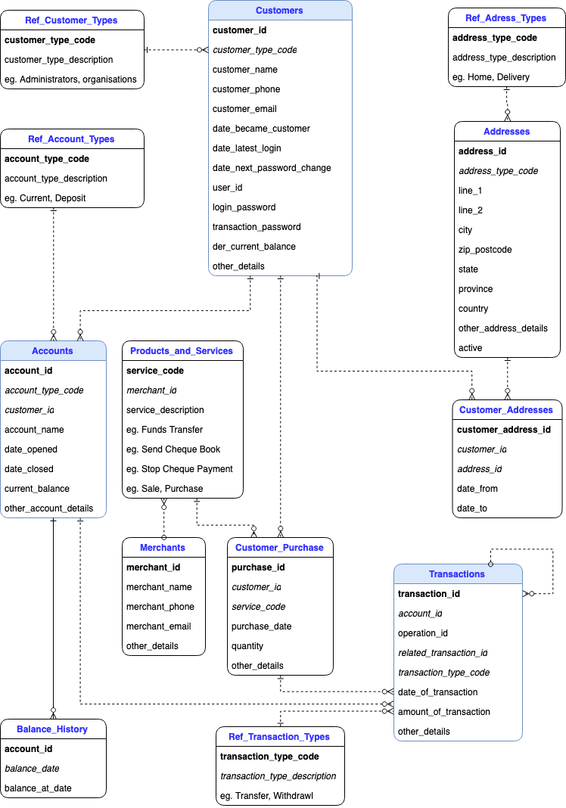

# Online Banking Data Model - WIP

This workshop intends to cover many of the DynamoDB data modelling concepts/scenarios, this scenario was inspired by some online banking migrations that we have completed in the past years, but in general it contains situations from different customer experiences. The objective is educate around data modelling and how to denormalise your data, and work with DynamoDB.

## Octank Banking


Octank Banking is an APJ based institution that has over 40+ million users, it is one of the largest institutions in the region serving customers from over 20 years. The Octank banking institution is planing to launch their new online banking mobile application due to customer demand.


* The architecture team has been very worried about this new change since the Mainframe/System of record is already under pressure, and the Directors of the company have a cloud first approach, the architecture team has decided to go with a cloud native application running in AWS to overcome the problem of scaling and unknown patterns, they know they have 40M customers but they don’t have data to predict usage once the application is launched. 
* The main objective of this application is to offload the Mainframe/System of record and allow users to have a seamless experience while navigating the app.
* Marketing has suggested it might represent 10M+ active connections at any given time, but at this point it is very speculative. 
* The Mainframe/system of record will keep operating during the initial phases of the project, completing all the write operations. This means every transaction in the application needs to be informed/communicated to the existing backend.
*  The customer is very interested in exploring alternatives for their transactions, since they plan to move away from in-house data-centers in the next couple of years.
* Customers are expecting to connect from their mobile devices from different countries across APJ. Most of the users are located in Sydney, Singapore and Japan.


## What has been decided so far

The migration will happen in two steps, first the old transactions will be imported from the system of record in batches, the second phase includes a real time replication between the mainframe and the AWS cloud so customers can validate their transactions in near-real time.

The mainframe team will ensure the information is sent to AWS as a complete transaction and they have implemented controls to validate the data is upload successfully. Once the data is available in the S3 bucket you can start processing the transactions.

## Background

One transaction is the result of an activity that happens between two parties, for example when a customer pays the credit card, the money is transfer from the source account to the destination account, in this case the credit card account. The exception to this rule are DEPOSIT and WITHDRAWAL since the deposits assumes the money comes/is taken from cash from an ATM or a branch.

When the money is sent to an external party, or another banking institution, it the transaction should still be processed as between two (or more) accounts, but the transaction must be flagged as external.

There might be scenarios where transactions span multiple accounts, for example customers can choose to pay bills from their savings and every day account to pay their credit card, line of credit or mortgage. When the transactions span multiple accounts the result amount of the transaction must be 0. For example, you pay a bill from your savings account -$100 but you transfer the money to the merchant $100, at the end of the day the total amount of the transaction is 0.

Each party in a transaction generates an operation_id, this operation_id is unique per operation, in the example above you will get one operation_id for the movement from your savings account, and the deposit to the merchants account generates another operation_id.

## Mobile Banking Application

*[BR1] -* Customers will be presented with a welcome page with a summary of all their accounts. Information as accounts name, number and balance up to date (With the date of the last transaction on top).

*[BR2] -* Customers can update their personal information, like email address, physical address, phone number, etc.

*[BR3] -* When the customer opens each account it should present the last 30 operations starting with the most recent ones. 

*[BR4] - *Customers can search for transactions that occurred during a specific period of time, for example: A customer can ask for all the transactions from his accounts from the last 15 days“. Customers can search by account, or they can ask for all their history for the last 30 days. 

*[BR5] -* Customers and security requires to query transactions by transaction ID, this query should return all the parties that were involved in a transaction, for this the customer can click on the transaction ID available at the account detail, or they can just type the exact transaction id.

*[BR6] -* Scheduled payments, there is a batch processing that works every night that needs to process the payments and send them back to the system or record, this process happens every first hour of the day,  and it will process the data from the previous day from 00:00:00 <= < 00:00:00.

At this point the bank enabled real time processing not just batch processing.

*[BR7] -* Customers should reflect their current balance up to date based on incoming transaction, this is done per account. 

*[BR8] -* There is been some incidents where security wants to automatically suspend cards based on suspicious activity and deliver an SMS to customers, the initial scope for this is to flag transactions from the same account that occurred in different cities during the same 30 minute window. For example a credit card transaction in person from Sydney and then another transaction in person in Melbourne within 15 minutes.

## Incoming Data format

Each transaction generates one operation_id per account (what would happen if we don't have this unique operation_id?), and the same transaction can occur in different accounts as explained in the section above.

The first batch of information consist on customer metadata, and simple account information, this information will be send as the first in batches, only the customers that are present in those batches will have access to the online banking program, think about it like a way to define beta testers. 

```JSON
{
    "customer_id":"4082-82388216-2310",
    "first_name":"Osborn",
    "last_name":"Braidford",
    "email":"obraidford0@eepurl.com",
    "address":{
        "street_address":"7641 Pine View Pass",
        "postal_code":"357-0211",
        "city":"Morohongō",
        "country":"Japan"
        },
    "accounts":[
        {
            "account_id":"419-653249-8586",
            "account_name":"Credit Titanium"
        },
        {
            "account_id":"517-513534-1146",
            "account_name":"Every Day"
        },
        {
            "account_id":"056-932264-9238",
            "account_name":"Credit Black"
        }
    ]
}
```

To simplify processing logic during this workshop we will assume the data is received per transaction, so we will have the entire transaction in JSON format, one object per account:

```JSON
{
    "transaction_id":"11932-49801-07082-53869",
    "operations":[
        {
            "account_id":"349-552407-2873",
            "operation_id":"5530-483520-822449-4592",
            "amount":3578
        },
        {
            "account_id":"505-816979-3351",
            "operation_id":"0092-913394-407864-3714",
            "amount":2707
        }
    ],
    "date":"2022-03-16T09:31:51Z"
}
```

The transactions will be deliver in two different ways, the first one is by batch processing, and then after the initial phase you will be receiving the transactions in real time with this format.


* We have 3 top level entities Customers, Accounts and Transactions
* Customers Make Purchases, not only purchasing things with their debit/credit card but also buying stuff from the bank, like cheques, wire transfers or stop payments, etc. 

## Data Modelling

The backend/mainframe team provided the following ERD to help us model the data, this is the structure they currently have in their tables.



Conversation Starters:


* What are the top 3 level entities? 
* How are they related together? 
* By looking at the ERD can you predict the access patterns?


You always need to start with questioning your data modelling, what are the access patterns you need to solve? every DynamoDB design requires to work backwards from the access patterns. Before you continue, review the business requirements. 


*[BR1] -* Customers will be presented with a welcome showing their account’s summary page. Information as accounts name, number and balance up to date (With the date of the last transaction on top).


Use the table below to enter the Queries you can predict from that business requirement:


ID	Query	PK	SK	Filter
BR1-1	Get all accounts summary by customer_id			
BR1-2	Get individual account summary by customer_id and account_id 			
BR1-3	Update account summary by customer_id and account_id			
BR2-1	Get customer information by customer_id			
BR2-2	Update customer information by customer_id			
BR2-3	Delete customer information by customer_id			
BR3-1	Get last 30 operations by account_id sorted desc			
BR3-2	Create operation by account_id			
BR3-3	Update operation by account_id and operation_id			
BR4-1	Get all transactions by customer_id where transaction date is in between date range sorted desc			
BR4-2	Get all transactions by account_id where transaction date is between date range sorted desc			
BR5-1	Get transaction operations by transaction_id			
BR6-1	Get all scheduled payments for the last 24 hours.			
BR6-2	Set scheduled payment by account_id and date			
BR6-3	Delete scheduled payment by account_id and date			
BR6-4	Update scheduled payment by account_id and date			
				


* After reading all those access patterns, can you identify what could be a good candidate for the primary key?
* How do you know which one is the best partition key? 
* What are the relationship between the entities?
* Is it better to have a composite primary key, using partition and sort key? What happens when we identify a good candidate? How can you translate it to a DDB design?


Do not move from this point until you have identified a Primary key, and justify your reasoning behind.

It is always a good idea to focus on the top level entities first, in this case, customers, transactions and accounts. There are operations that could be portion of a larger transaction, at the same time operations and transactions need to be associated to an account. (Even if the account is a merchant account, or an external provider). 

Customers, we could have different type of customers, we could have personal, commercial or organisations. 


* How can we tie together a customer, an account, and the operations?
* What happens when the customer has several accounts?


Account one will have some transactions, and when I log to the online banking portal you might be interested in the latest transactions by timestamp, you also should include the transaction ID just to ensure uniqueness of the operations, depending of the number of your precision digits, you might have duplicated transactions in the same second, or 100’s of milliseconds.


